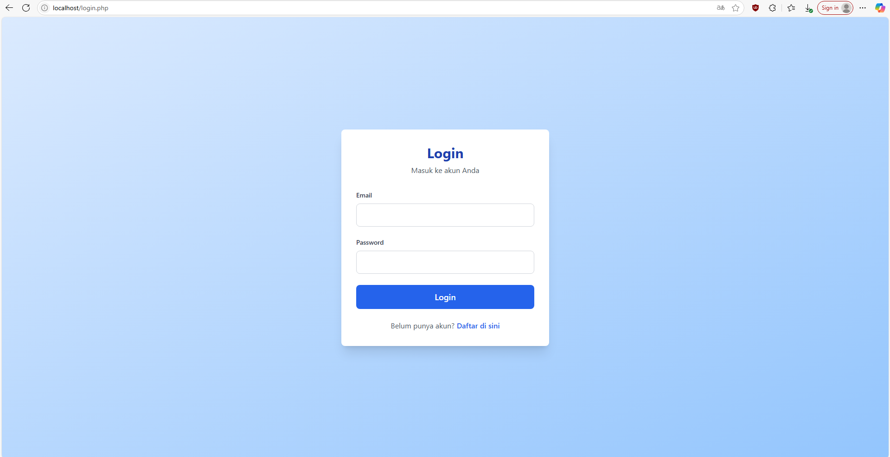
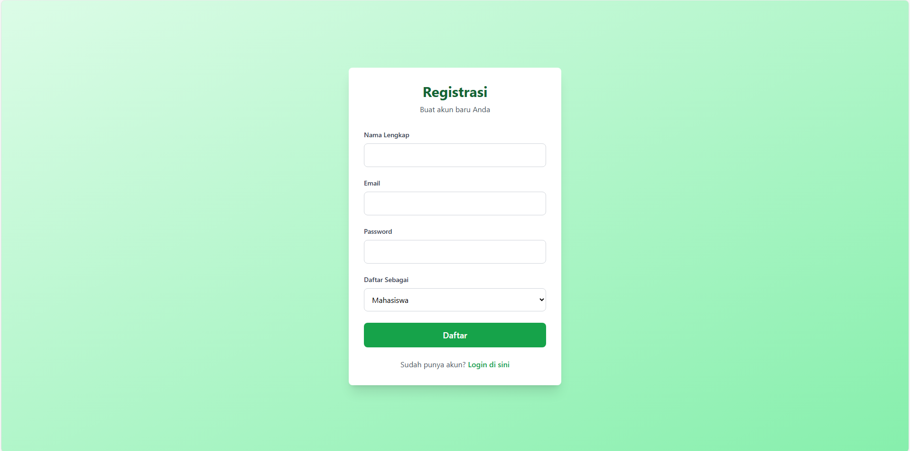
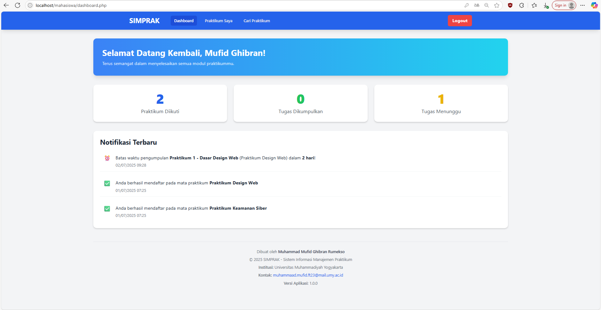
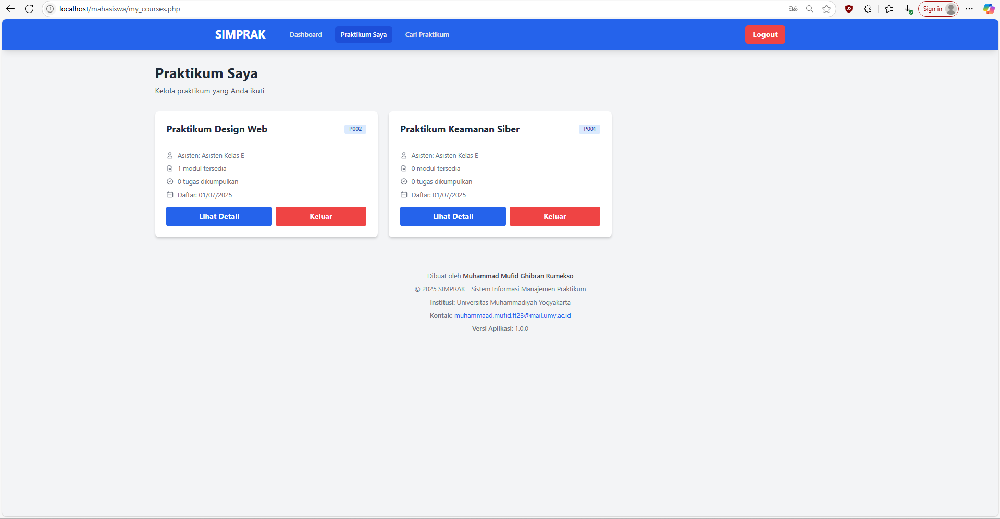
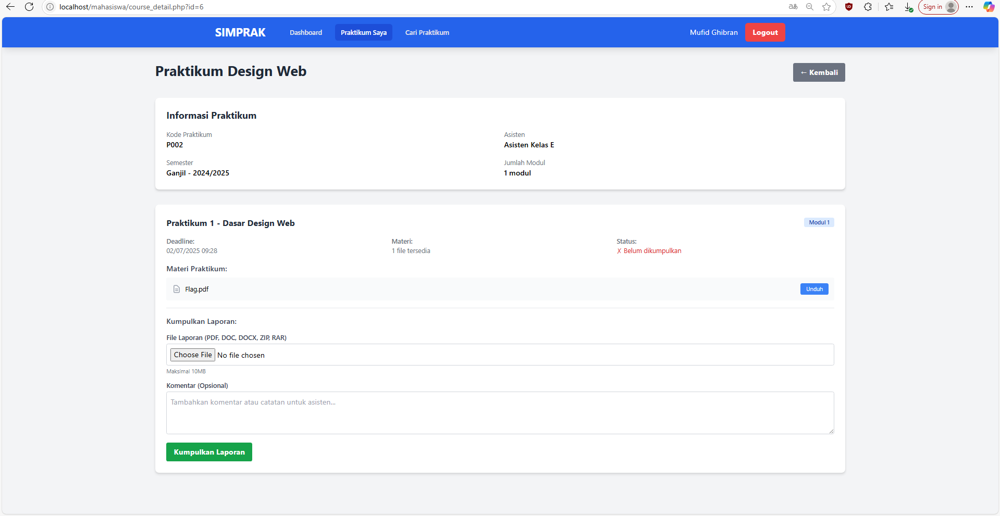
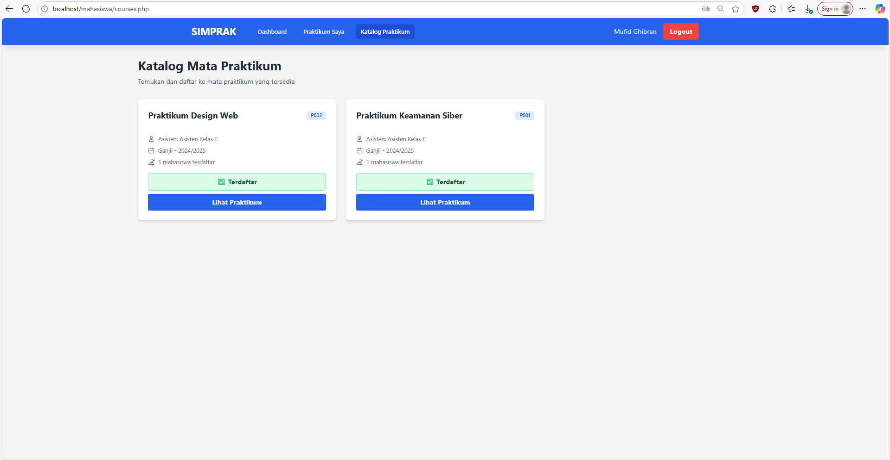
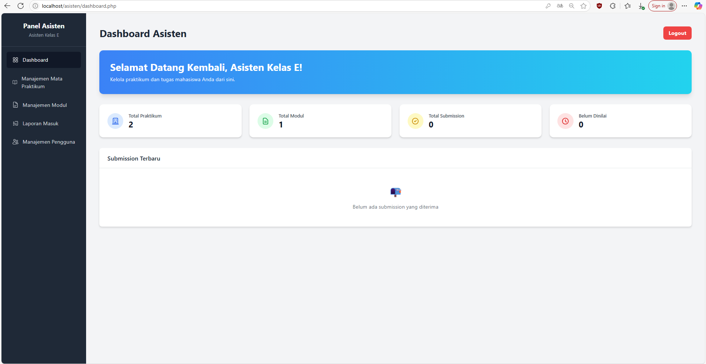
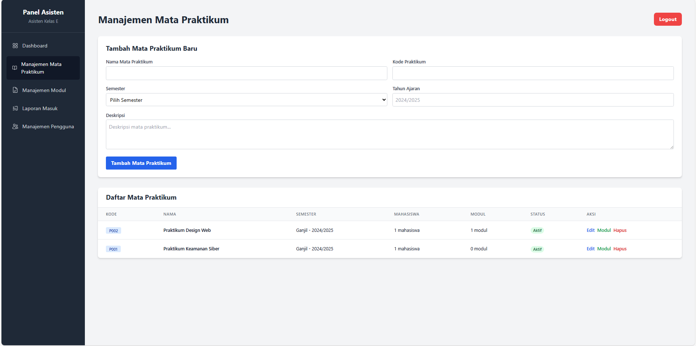
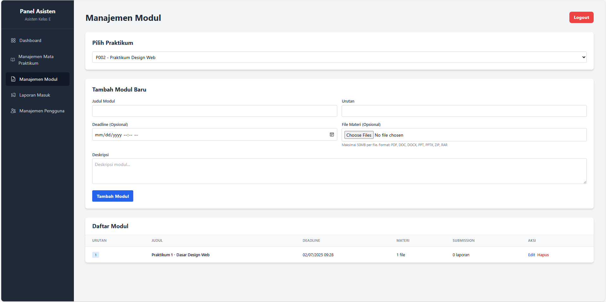
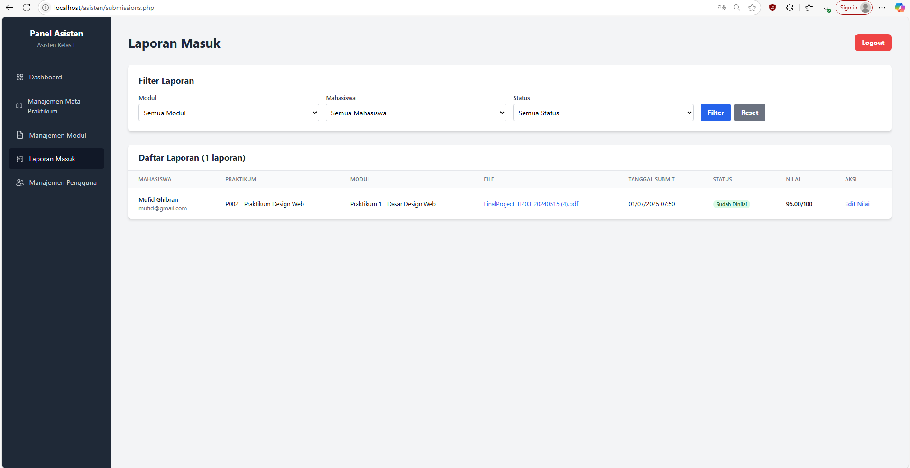

# SIMPRAK - Sistem Informasi Manajemen Praktikum

Aplikasi manajemen praktikum berbasis PHP Native, MySQL, dan Tailwind CSS.

---

## Daftar Isi
- [Fitur](#fitur)
- [Tampilan Antarmuka (UI)](#tampilan-antarmuka-ui)
- [Instalasi](#instalasi)
- [Kontak](#kontak)

---

## Fitur
- Login & Register (Mahasiswa & Asisten)
- Dashboard Mahasiswa & Asisten
- Manajemen Praktikum, Modul, Materi, dan Tugas
- Upload & Download File
- Penilaian Tugas
- Filter & Statistik

---

## Tampilan Antarmuka (UI)

### Login

### Register
   

### Dashboard Mahasiswa

### Praktikum Saya

### Detail Praktikum Saya

### Detail Praktikum Saya

### Dashboard Asisten

### Manajemen Praktikum

### Manajemen Modul

### Manajemen Modul

---

## Instalasi

1. Clone repository ini.
2. Import file `database.db` ke MySQL/MariaDB.
3. Atur koneksi database di `config.php`.
4. Jalankan di server lokal (XAMPP/Laragon/dll).

---

## Kontak

- **Dibuat oleh:** Muhammad Mufid Ghibran Rumekso  
- **Institusi:** Universitas Muhammadiyah Yogyakarta  
- **Email:** muhammaad.mufid.ft23@mail.umy.ac.id

--- 
